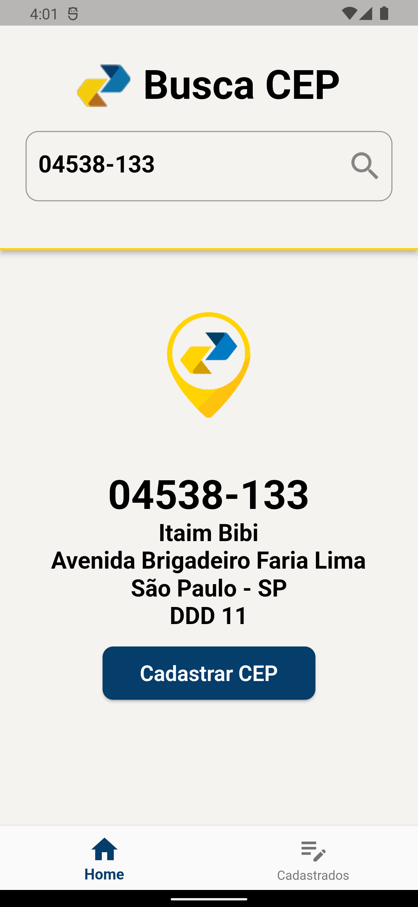

# 📫 CRUD API viaCEP

## Sobre o projeto

O aplicativo faz uso da API VIA CEP para obter detalhes relacionados a CEPs (Códigos de Endereçamento Postal) e realiza operações de CRUD (Criar, Ler, Atualizar, Excluir) para endereços, armazenando esses dados por meio do serviço Back4App.

Isso possibilita que os usuários criem novos registros de endereços, façam atualizações em informações já existentes e removam entradas quando necessário. Em resumo, o aplicativo oferece a funcionalidade de gerenciar informações de endereços de forma flexível e integrada com as funcionalidades da API VIA CEP e o serviço Back4App.

## Screenshots

  

### Tecnologias utilizadas

- Flutter
- Bloc
- Back4App
- ViaCep API
